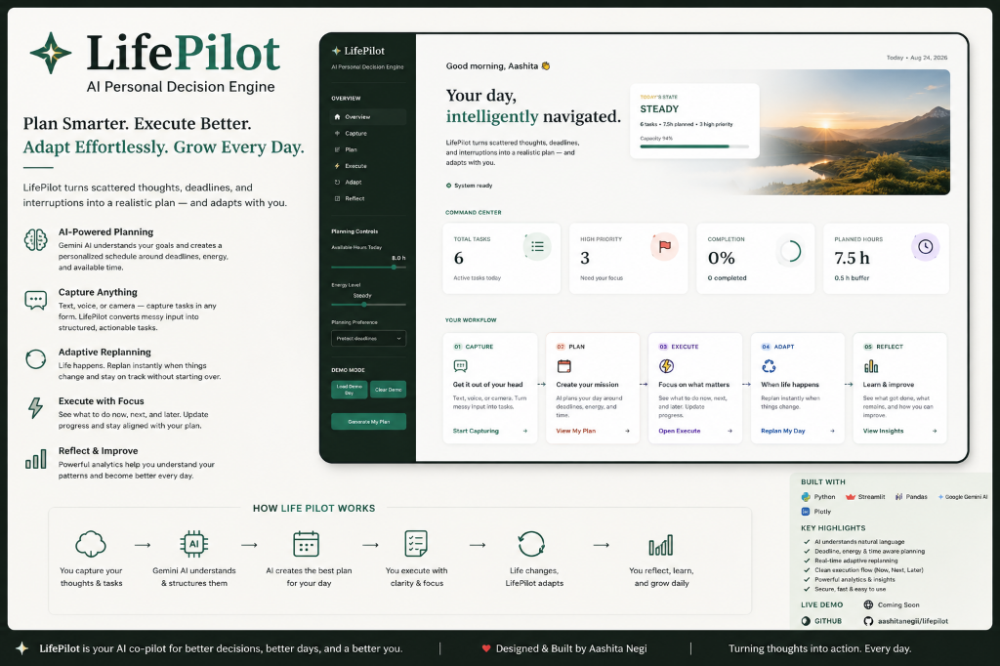
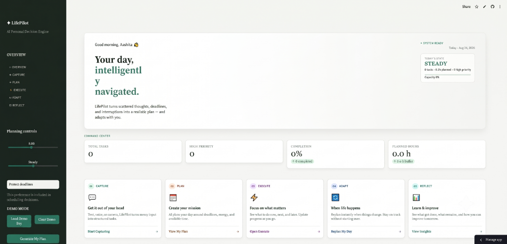
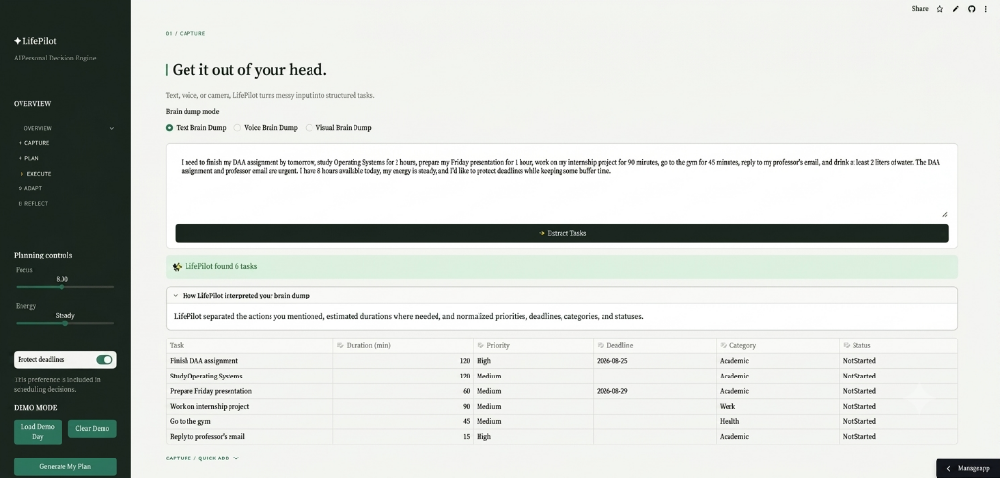
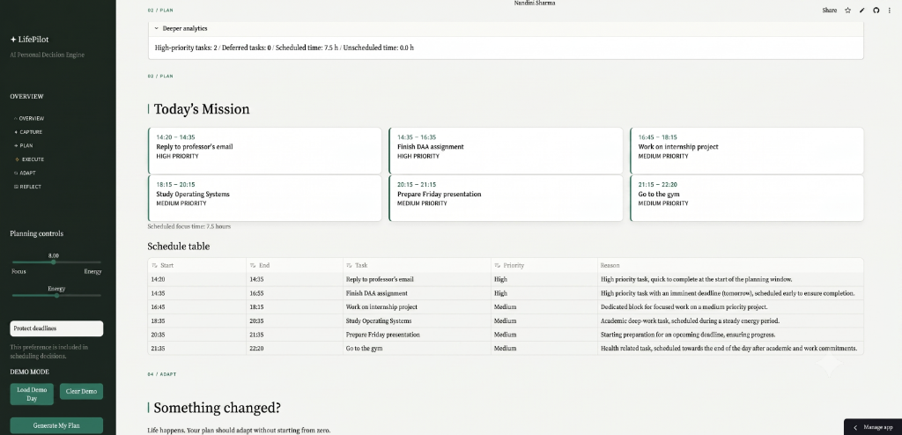
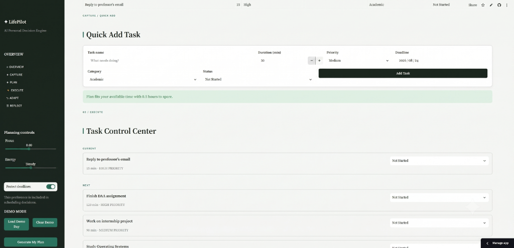
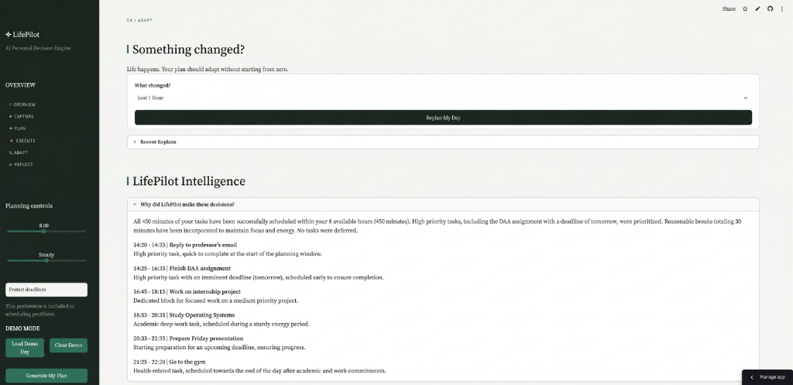
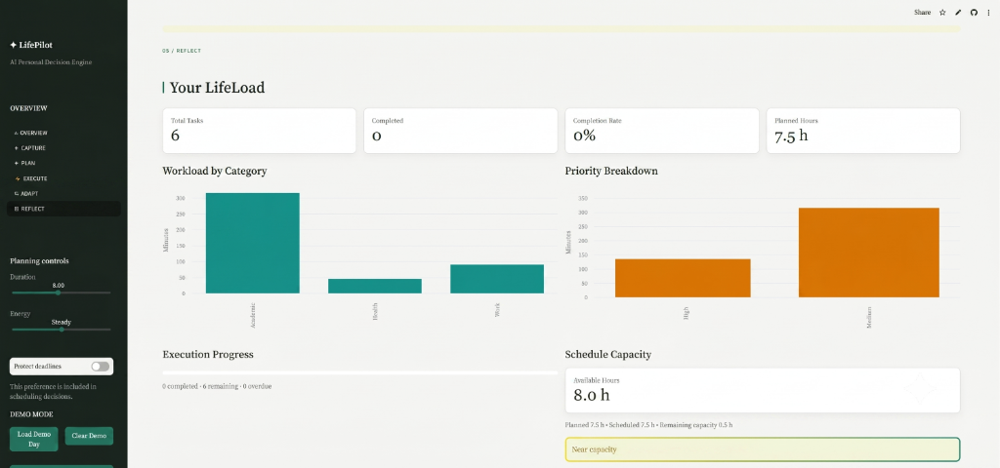

# LifePilot



## AI-powered personal planning, scheduling, execution, and adaptive replanning

Turn messy thoughts, interruptions, and constraints into a realistic mission you can actually execute. LifePilot acts as your personal command center, analyzing your tasks through Google Gemini to help you make intelligent scheduling decisions under capacity constraints.

## Live App

[Live App](#) - *(Deployment URL to be added after Streamlit Community Cloud deployment)*

## Product Screenshots

### 2. Overview — Command Center


### 3. Capture — Brain Dump to Structured Tasks


### 4. Plan — AI-Generated Daily Mission


*Execute with clarity: LifePilot turns the generated plan into concrete time blocks, priorities, and an actionable schedule.*

### 5. Execute — Today's Mission


### 6. Adapt — Adaptive Replanning


*When plans change, LifePilot adapts instead of starting over—rebalancing the day while explaining its scheduling decisions.*

### 7. Reflect — LifeLoad Analytics


## Feature Overview

LifePilot structures the chaotic human day into five distinct workflows:

- **CAPTURE**: Convert messy thoughts into structured tasks via Text, Voice, or Visual (Camera) brain dumps.
- **PLAN**: Define available hours, energy levels, and planning preferences. Let Gemini build a realistic schedule honoring constraints.
- **EXECUTE**: A focused control center showing your CURRENT, NEXT, and LATER tasks. Easily track progress and update task statuses.
- **ADAPT**: Life happens. Handle unexpected disruptions (e.g., surprise meetings, energy crashes) by asking Gemini to Replan your remaining day without starting from scratch.
- **REFLECT**: Deterministic data views and charts tracking completion rates, workload distribution, and scheduled vs. unscheduled capacity.

## Architecture

LifePilot combines Streamlit's reactive UI with Pandas for state management and Google Gemini for intelligent parsing and decision-making. 

The architecture strictly delineates AI operations from deterministic constraints:
- **Gemini** understands inputs, prioritizes tasks, proposes schedules, and explains trade-offs.
- **Python / Pandas** stores state, calculates capacity, enforces data validation, and manages the execution loop.

```text
User Input (Text/Voice/Vision)
         ↓
    Streamlit UI
         ↓
  Gemini Extraction
         ↓
 Structured Task JSON
         ↓
  Validation Layer
         ↓
   Pandas State (tasks_df)
         ↓
    Scheduler Engine
         ↓
    Execute Layer
         ↓
Replanner / Analytics
```

For more details, see [TECHNICAL_DESIGN.md](TECHNICAL_DESIGN.md).

## Setup & Deployment

### Local Setup

```bash
git clone <repository-url>
cd mirai-ai-internship-2026/final_project/lifepilot
python -m venv .venv
# Activate virtual environment (Windows):
.venv\Scripts\activate
# Install requirements:
pip install -r requirements.txt
```

### Configuration

Create a local `.streamlit/secrets.toml` file to securely store your API key:
```toml
GEMINI_API_KEY = "your-google-gemini-api-key"
```

### Run Locally
```bash
streamlit run app.py
```

### Deployment to Streamlit Community Cloud
1. Create a new Streamlit app connected to your repository.
2. Set the main file path to `final_project/lifepilot/app.py`.
3. Go to Advanced Settings -> Secrets and paste the `GEMINI_API_KEY` configuration.
4. Deploy!

## Gemini Integration

LifePilot uses the official `google-genai` SDK to interact with Google Gemini.

- **Efficiency**: API calls are explicitly triggered by user actions (e.g., "Generate My Plan", "Replan My Day"). We never blindly call Gemini on page loads, widget changes, or analytics rendering.
- **Structured Outputs**: Prompts enforce structured JSON returns to ensure reliable parsing.
- **Explainability**: Scheduling blocks include explicit AI reasoning so you understand *why* a task was scheduled when it was.

## Demo Mode

For evaluators and quick testing, LifePilot includes a **Demo Mode**. 
- Open the sidebar and click **Load Demo Day**.
- This instantly populates a realistic, localized set of tasks and metrics to showcase the application's states.
- Demo Mode relies on deterministic sample data and **does not consume Gemini API credits**.
- Use the **Clear Demo** button to return the app to a clean, empty state.
