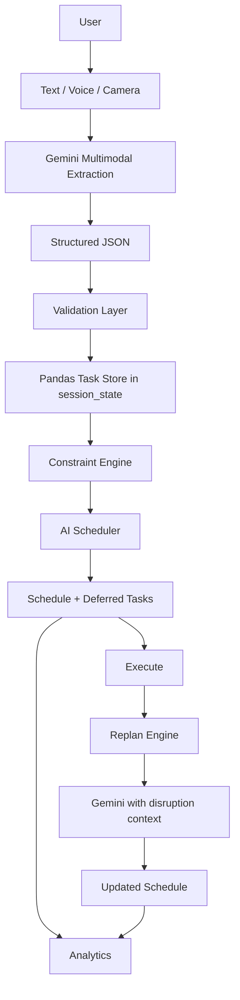

# LifePilot Technical Design

## Project Overview

**LifePilot: AI Personal Decision & Execution Engine**

## Problem

People manage fragmented tasks, changing priorities, interruptions, and limited available time across disconnected tools.

## Solution

LifePilot converts unstructured text, speech, and images into structured tasks, plans the day under explicit constraints, and replans when circumstances change.

## Architecture

```text
Text / Voice / Image
        |
Gemini Multimodal Extraction
        |
JSON Validation
        |
Pandas Task State
        |
Constraint Engine
        |
Gemini Scheduler
        |
Schedule DataFrame
        |
Execution / Replanning / Analytics
```



## Modules

- `app.py`: Streamlit interface, session state, forms, and user-triggered actions.
- `ai_engine.py`: Shared Gemini client and text, audio, and image extraction calls.
- `task_parser.py`: JSON parsing, schema normalization, and schedule validation.
- `scheduler.py`: Dynamic scheduling and replanning prompts plus Gemini calls.
- `constraints.py`: Deterministic duration, capacity, completion, and serialization helpers.
- `analytics.py`: Deterministic dashboard metrics and workload summaries.

## State Management

`st.session_state` keeps tasks, schedules, deferred work, summaries, and replan history available across Streamlit reruns. `tasks_df` remains the canonical task source.

## API Strategy

Gemini calls happen only after explicit form or button submissions. System prompts constrain each operation to extraction, scheduling, or replanning. Dynamic context includes current conditions and serialized DataFrames. Responses are validated before entering state. API keys are read from `st.secrets` and never stored in Python source.

## Multimodality

Text brain dumps use a text prompt. Voice brain dumps attach microphone audio for transcription and extraction. Visual brain dumps attach camera images of lists, whiteboards, notebooks, or screenshots. All three paths return the same task schema.

## Replanning

A disruption submission sends the active tasks, current schedule, remaining capacity, and disruption context to the replanning engine. Completed work remains locked, high-priority and deadline-sensitive work is protected where possible, and lower-priority work can be deferred with reasons.

## Validation

AI output is untrusted input. LifePilot validates JSON shape, required fields, task references, times, priorities, duplicate schedule entries, source durations, overlaps, and capacity before displaying or persisting it.
